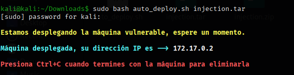
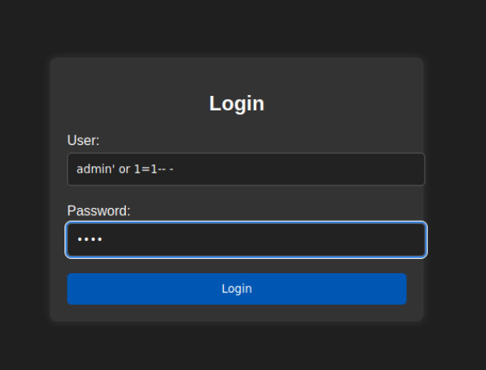

# Máquina Injection

Dificultad -> Muy fácil

Enlace a la máquina -> [Dockerlabs](https://dockerlabs.es/)

**Imprescindible tener instalado Docker**. Docker te permite ejecutar programas de forma aislada y portátil, como si cada programa tuviera su propio mini-ordenador dentro de tu PC.

## Despliegue del laboratorio
 Una vez descargada la máquina, debemos realizar los siguientes pasos para tener acceso a la máquina:
 
 En primer lugar veremos que tenemos descargado un zip con dos archivos un .sh y un .tar.
 
 ### Archivos
 
.sh → Script de Linux con comandos. Se ejecuta en la terminal.

.tar → Archivo que agrupa otros archivos/carpetas.

Para el despliegue de la máquina tendremos que ejecutar el siguiente comando:
```shell
sudo bash auto_deploy.sh inyection.tar
```

En resumen: se está ejecutando con permisos de superusuario root (si no no funciona) un script que recibe un archivo .tar y hace lo que esté programado dentro del script con ese archivo.



Este es el resultado de ejcutar el comando bash como root para iniciar la máquina. Vemos que nos da una dirección IP sobre la que podemos empezar a operar. Además vemos que para borrar todo de la máquina basta con hacer Ctrl+C, por lo que lo que recomiendo es abrir una nueva terminal al lado para resolver la máquina y una vez resuelta volver a esta y borrarla.

## Reconocimiento

Comenzamos realizando un escaneo general con **nmap** sobre la IP de la máquina víctima para ver que puertos tiene abiertos.

```shell
nmap -p- --open -sT --min-rate 5000 -vvv -n -Pn 172.17.0.2 -oG allPorts
________________________________________________
PORT   STATE SERVICE REASON
22/tcp open  ssh     syn-ack
80/tcp open  http    syn-ack
```

***

Este comando de Nmap usa varias flags para realizar un escaneo completo de todos los puertos TCP de la IP 172.17.0.2. La flag -p- indica que se deben escanear todos los puertos posibles (0-65535), mientras que --open filtra el resultado para mostrar solo los puertos abiertos. La opción -sT realiza un TCP Connect Scan, es decir, se conecta completamente a cada puerto en lugar de hacer un escaneo semiabierto. Con --min-rate 5000 se fuerza a Nmap a enviar al menos 5000 paquetes por segundo, acelerando el proceso, y -vvv activa el modo verbose muy detallado, mostrando información adicional durante el escaneo. La flag -n evita la resolución DNS para usar solo la IP, y -Pn hace que Nmap no realice ping previo, asumiendo que el host está activo. Finalmente, -oG allPorts guarda la salida en un archivo en formato grepable, útil para filtrarlo o procesarlo después.


La salida indica que Nmap no hizo ping previo al host y asumió que estaba activo. Se escanearon los 65.535 puertos de la IP 172.17.0.2 y se descubrió que solo los puertos 22 (SSH) y 80 (HTTP) estaban abiertos, mientras que el resto estaban cerrados. La parte final confirma que el host respondió rápido, muestra el estado de los puertos encontrados

## Explotación

Accedemos a la web y encontramos un **panel de login**. Por el nombre de la máquina, intentamos explotarlo con una **SQL Injection**.

Introduciendo admin como usuario y de contraseña  ' OR '1'='1 para que siempre sea verdadero, y cualquier cosa en la **password**. Si en el login pones usuario: admin y en la contraseña  ' OR '1'='1, la base de datos entiende que la condición será siempre verdadera, así que te deja entrar como admin sin importar la clave real. 

Esto funcionaría como una consulta del siguente tipo en la base de datos:

```sql
SELECT * FROM usuarios WHERE usuario = 'admin' AND password = ' OR '1'='1';
```
Como 1=1 siempre es verdadero, la consulta devuelve el usuario admin aunque la contraseña esté mal.

Por eso te deja entrar: la condición se vuelve siempre verdadera.



Conseguimos bypasearlo exitosamente!


```
KJSDFG789FGSDF78
```

Probamos esta contraseña con el usuario **dylan** en el protocolo **ssh**.

```shell
ssh dylan@172.17.0.2
```

Estamos dentro !

***

## Escalada de privilegios

Podemos probar a usar sudo su para acceder directamente como root pero vemos que no funciona porque en esa máquina no está instalado sudo. 

Por tanto tenemos que probar otras formas de escalar privilegios como los binarios SUID (/usr/bin/env, passwd, etc.) o vulnerabilidades del sistema, porque no puedes pedir permisos de root con sudo si no está instalado.


Primero, con el comando find / -perm -4000 2>/dev/null lo que haces es buscar todos los programas que tienen el bit SUID activado en el sistema. Los binarios SUID son programas que, al ejecutarse, toman los permisos de su propietario en lugar de los permisos del usuario que los llama. En la mayoría de los casos, estos programas son propiedad de root, por lo que pueden ejecutarse con privilegios elevados aunque los invoque un usuario normal.

Entre los resultados que devuelve la búsqueda aparece /usr/bin/env. Este binario puede usarse para abrir una shell con los permisos de root porque tiene SUID. Al ejecutarlo con la opción de abrir bash manteniendo privilegios, se crea una nueva shell que hereda los permisos del binario, es decir, los permisos de root.

Después, al consultar quién eres con whoami dentro de esta nueva shell, te devuelve root. Esto significa que ahora tienes acceso completo como root, con todos los permisos del sistema. En pocas palabras, encontraste un binario con privilegios especiales y lo usaste para elevar tus privilegios de usuario normal a administrador del sistema.


Hemos alcanzado el nivel de privilegios máximos en el sistema!


